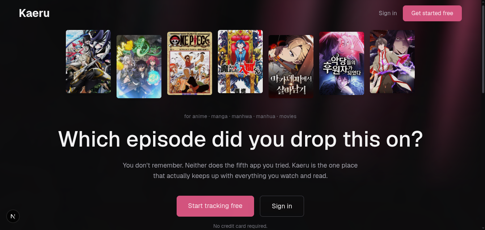

Kaeru is a unified tracker for anime, manga, manhwa, manhua, and movies. No more losing your place across five different apps and a spreadsheet you forgot to update.

## Tech Stack

- **Framework:** Next.js (App Router, React Server Components)
- **Database / ORM:** Prisma
- **Data source:** AniList GraphQL API
- **Styling:** Tailwind CSS v4
- **Icons:** Lucide

## Status

🚧 Actively in development - this is a solo portfolio project, not yet open for public sign-ups.

## Why Kaeru

Most tracking apps make you pick a lane: anime *or* manga, one format at a time. Kaeru puts everything - anime, manga, manhwa, manhua, and movies on one shelf, with a single view of what you've watched, read, and where you left off.

## Features

- **One shelf, every format** - anime, manga, manhwa, manhua, and movies tracked together instead of scattered across separate apps
- **Progress you can trust** - always know exactly which episode or chapter you're on
- **Year in review** - a GitHub-style activity grid of everything you've actually finished
- **Built for the dark** - a proper dark theme, not a white screen at 1am
- **Trending on load** - the landing page pulls live trending titles straight from AniList

## License

TBD